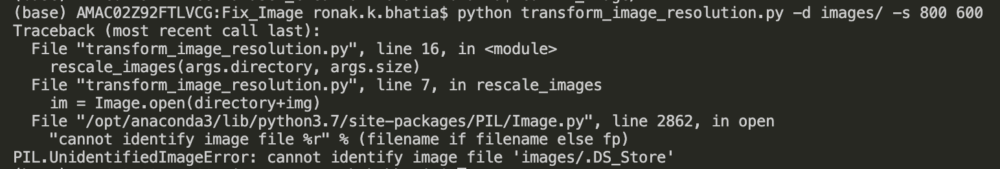
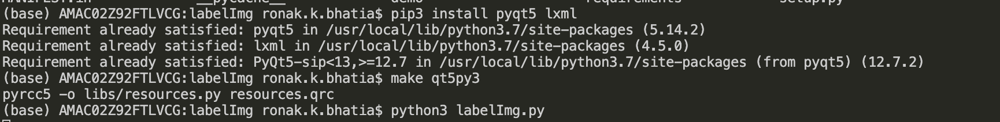
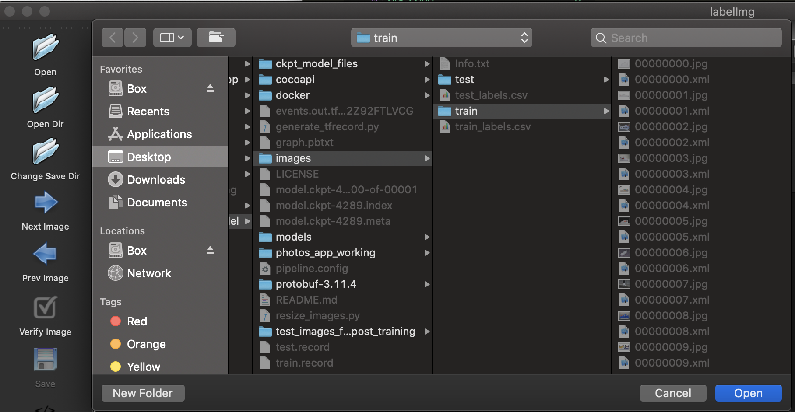
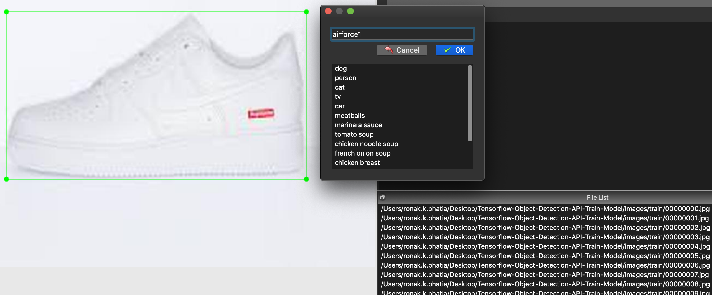

# Introduction 

This folder, entitled Dataset_Creation, contains resources for auto-formatting ML photos for training in addition to the specific dataset that I created and labeled for the project. The dataset I created is in a folder called ```Shoe_Dataset```. 

It's important to note that the process for gathering your test/train photos should be done before doing anything in this directory. 

## Fix_Image

Inside the ```Fix_Image``` folder, there is a folder called ```images``` which should be empty. Before training the model or creating the testing or training directories, it's essential to reformat the images (at least, for the way I'm doing it in TensorFlow) to reduce the resolution of the images. This is crucial to prevent the training process from taking too long. Let's say that you have taken your photos and you've added them to the images folder. The next step is to make sure you're in the ```Fix_Image``` directory. Next, run the following command in terminal: ```python transform_image_resolution.py -d images/ -s 800 600```. This automatically changes the resolution of all the photos in the images folder via a Python script. The script has run properly if you get no output. You can check if the script has actually worked by going into the images folder and seeing the resized images - they will look different than the original photos!

### Troubleshooting

Sometimes, the following error will happen - preventing you from successfully. 


To fix this error, please try removing DS_Store by first going to the images directory (```cd images```) and running ```rm .DS_Store```. 

## LabelImg

LabelImg is a tool that works on all platforms that enables users to label images for multiple object detection by manually applying bounding boxes to the images. The link to LabelImg's repo is [here](https://github.com/tzutalin/labelImg). 

To reiterate, being on this step of the process implies that you've already acquired the photos for training/testing as well as changed their sizes using the Fix_Image code above. Now, after git cloning the labelImg repository or navigating to the labelImg repository, please run the following commands to get labelImg working:

```python
pip3 install pyqt5 lxml # Install qt and lxml by pip
make qt5py3
python3 labelImg.py
```

There is another way to install this, which is using Homebrew. I haven't tested this method, but you are free to try it out and see if it works for you:

```python
brew install qt  # Install qt-5.x.x by Homebrew
brew install libxml2

make qt5py3
python3 labelImg.py
```

It should look something like this if done correctly: 


It's very important to note that you need to be inside the labelImg folder for this to work. If you aren't in the folder, you will get an error that says ```make: *** No rule to make target `qt5py3'.  Stop.```

Once you run all of this, labelImg should pop up. From here, you want to open the train and test folders in the application. You can do that by clicking on the ```Open Dir``` (second button down in the left corner) and navigating to the repository that contains your testing/training photographs (assuming you've placed them appropriately and resized them).It should look like the following:  



Now, you need to go through each train/test photo in the respective folders. For each photograph, you need to click ```Create\nRectBox```, draw a bounding box (or multiple depending on if you're doing multiple object detection), and write a label for the thing inside the bounding box you drew. Here's an example with a Nike Air Force 1 shoe! 



When you finish drawing the bounding box and providing a label (which should be same for every instance of an object/image [e.g. all types of a shoe should be labeled with the same label - no change in uppercase/lowercase, etc]), you need to save by clicking the save button. If things went right, you will see an XML file appearing in the same directory with the same name for the image labeled. 

Further steps on how to generate TFRecords for training the machine learning model based on this work will be available in a blog post I've written. You will be using two scripts called ```xml_to_csv.py``` and ```generate_tfrecords.py```. 
